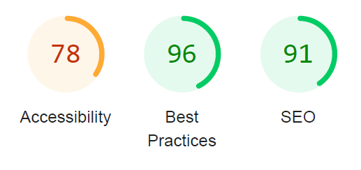
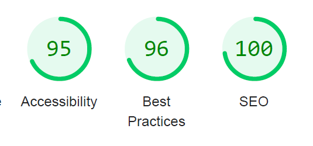

### Ru

# Plants - лендинг студии садового дизайна на чистом JavaScript

## О проекте

Проект начинался как учебная работа по вёрстке, но перерос в площадку для практики и совершенствования frontend-навыков. В процессе развития он прошел несколько этапов модернизации:

1. Базовая вёрстка HTML/CSS/JS (2022)
2. Рефакторинг с использованием SASS и доработка js-функционала (2023-2024)
3. Полная переработка с упором на SEO отпимизацию и улучшение показателей Accessibility(2025)

## Ветки (Branches)

- **plants-part3** – итоговая версия курсового проекта, отправная точка для рефакторинга
- **plants-refactoring** – внедрение SASS и Webpack
- **plants-portfolio-upgrade** (текущая) – улучшение SEO и Accessibility

## Последние улучшения

- Переработана архитектура стилей с использованием методологии БЭМ
- Пересмотрены SASS-миксины и плейсхолдеры
- Улучшена семантика HTML и добавлены ARIA-атрибуты
- Оптимизирована структура JavaScript-модулей
- Настроена микроразметка для SEO
- Доработана конфигурация Webpack

## Достижения

По метрикам Lighthouse:

- SEO: улучшение с 91 до 100 баллов
- Доступность (Accessibility): рост с 78 до 95 баллов

## Lighthouse Metrics

|                           Исходно                           |                           После                           |
| :---------------------------------------------------------: | :-------------------------------------------------------: |
|  |  |

## Технологии

- HTML5
- SASS/SCSS
- JavaScript (ES6+)
- Webpack
- БЭМ методология

## Ссылки

- [Макет в Figma](https://www.figma.com/file/ntVt8IwlwzfVFMBuVVAze8/Plants) \*
- [Текущая версия проекта](https://sashaivanovapro.github.io/plants/)

###### \* **Примечание**: Верстка выполнена в соответствии с принципом Perfect Pixel, однако макет может быть изменен дизайнером, поэтому возможны расхождения с текущим состоянием проекта.

## В планах

- Оптимизация производительности
- Сжатие и оптимизация изображений
- Улучшение загрузки ресурсов
- Code splitting

## Как запустить проект

```bash
npm install        # установка зависимостей
npm run start     # запуск в режиме разработки
npm run prod      # сборка продакшн версии
```

### En

# Plants - Garden Design Studio Landing Page with Vanilla JavaScript

## About

This project started as a learning exercise in web development but grew into a platform for practicing and improving frontend skills. The project has gone through several stages of modernization:

1. Basic HTML/CSS/JS layout (2022)
2. SASS refactoring and JavaScript functionality enhancement (2023-2024)
3. Complete rework focusing on SEO optimization and Accessibility improvement (2025)

## Branches

- **plants-part3** - final version of the course project, the starting point for refactoring
- **plants-refactoring** - SASS and Webpack implementation
- **plants-portfolio-upgrade** (current) - SEO and accessibility improvements

## Recent Updates

- Restructured styles using BEM methodology
- Revised SASS mixins and placeholders
- Enhanced HTML semantics and added ARIA attributes
- Optimized JavaScript modules structure
- Set up SEO microdata
- Updated Webpack configuration

## Achievements

Lighthouse metrics improvements:

- SEO score: from 91 to 100 points
- Accessibility score: from 78 to 95 points

#### Lighthouse Metrics Comparison

|                           Before                            |                           After                           |
| :---------------------------------------------------------: | :-------------------------------------------------------: |
|  |  |

## Technologies

- HTML5
- SASS/SCSS
- JavaScript (ES6+)
- Webpack
- BEM methodology

## Links

- [Figma Design](https://www.figma.com/file/ntVt8IwlwzfVFMBuVVAze8/Plants) \*
- [Live Demo](https://sashaivanovapro.github.io/plants/)

###### \* **Note**: The layout follows the Perfect Pixel principle, but the design may be modified by the designer, so there may be discrepancies with the current state of the project.

## Future Plans

- Performance optimization
- Image compression and optimization
- Resource loading improvement
- Code splitting

## How to Run

```bash
npm install        # install dependencies
npm run start     # start development server
npm run prod      # build production version
```
